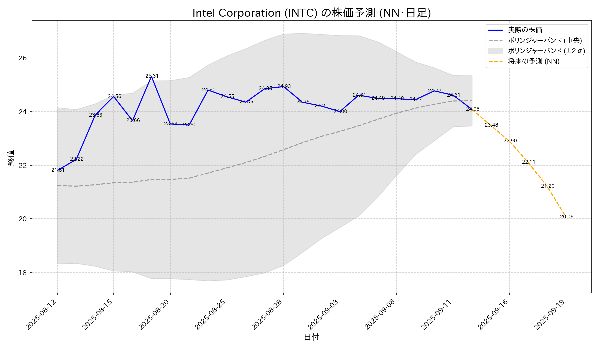

# 株価予測プロジェクト

## 概要

このアプリケーションは、過去の株価データを分析し、機械学習モデル（LSTM, GRU, NN）を用いて将来の株価を予測し、結果をチャートで可視化します。

## 特徴

- 複数の機械学習モデル（LSTM, GRU, NN）による株価予測
- 過去のデータと将来の予測値を結合したチャートを生成
- 証券コード、モデル、時間枠（日足/週足/月足）などをコマンドライン引数で指定可能

---

## 動作要件

- Python 3.10 以降
- 日本語フォント（Takao-PGothic）

---

## セットアップ手順

### 1. リポジトリのクローン

```bash
git clone https://github.com/mame-777/analyzestock.git
cd analyzestock
```

### 2. システム依存関係のインストール (Linux)

`pip` でPythonライブラリをインストールする際、コンパイルに必要なシステムパッケージをあらかじめインストールしておきます。

```bash
# Debian / Ubuntu の場合
```bash
sudo apt-get update && sudo apt-get install -y \
    python3 \
    python3-pip \
    build-essential \
    python3-dev \
    libffi-dev \
    libssl-dev
```
```

### 3. Python依存関係のインストール

プロジェクトに必要なPythonライブラリをインストールします。

```bash
pip install -r requirements.txt
```

### 4. 日本語フォントのインストール (Linux)

グラフの日本語表示のために、Takao-PGothicフォントをインストールします。

```bash
# Debian / Ubuntu の場合
sudo apt-get update && sudo apt-get install -y fonts-takao-pgothic
```

もしフォントのインストール後に文字化けが解消されない場合は、Matplotlibのキャッシュを削除してみてください。

```bash
rm -rf ~/.cache/matplotlib
```


---

## 実行方法

### 株価予測の実行 (create_stock_prediction_chart.py)

`create_stock_prediction_chart.py` を実行して、株価予測と評価、チャート生成を行います。

**基本コマンド:** 
```bash
python3 create_stock_prediction_chart.py [オプション]
```

**主なオプション:** 

| オプション | 説明 | デフォルト値 |
| :--- | :--- | :--- |
| `--stock_code` | 予測対象の証券コード。日本の4桁数字コードは自動で".T"が付加され、それ以外は米国株などのティッカーとして扱われます。 | `9432` |
| `--model_type` | `lstm`, `nn`, `gru` からモデルを選択。 | `nn` |
| `--time_frame` | `daily` (日足), `weekly` (週足), `monthly` (月足) を選択。 | `daily` |
| `--epochs` | 学習のエポック数。 | `150` |
| `--seq_length` | 予測に用いる過去データのシーケンス長。 | `30` |
| `--fut_pred` | 何営業日先まで予測するか。 | `5` |
| `--hidden_unit_size` | 隠れユニット数 (LSTM, GRU用)。 | `128` |
| `--num_layers` | RNN層の数 (LSTM, GRU用)。 | `2` |
| `--nn_layer_units` | NNモデルの各隠れ層のユニット数をスペース区切りで指定。 | `100 50` |
| `--device` | `cpu` または `cuda` を指定。 | 自動検出 |
| `--debug` | デバッグ情報を表示します。 | `False` |

**注意点:**
- データ取得期間は、指定された`--time_frame`に応じて、日次データ20年分と同程度のデータポイント数を確保するように自動調整されます。

**実行例:** 
```bash
# 銘柄コード9432をデフォルトのNNモデルで予測
python3 create_stock_prediction_chart.py --stock_code 9432

# LSTMモデルで予測を実行
python3 create_stock_prediction_chart.py --model_type lstm

# NNモデルの隠れ層を256, 128ユニットで実行
python3 create_stock_prediction_chart.py --model_type nn --nn_layer_units 256 128

# 米国株INTCをデフォルトのNNモデルで予測
python3 create_stock_prediction_chart.py --stock_code INTC
```

```text
Stock Price Prediction v0.9
---

--- Parsed Arguments ---
Namespace(stock_code='INTC', model_type='nn', time_frame='daily', epochs=150, log_interval=10, seq_length=30, fut_pred=5, batch_size=32, hidden_unit_size=128, num_layers=2, nn_layer_units=[1024, 512, 128, 64], device=None, debug=False)
------------------------

Using device: cuda
Downloading stock data for INTC from 2011-03-02 to 2025-09-14 (auto-determined based on model requirements)...
YF.download() has changed argument auto_adjust default to True
[*********************100%***********************]  1 of 1 completed
Successfully downloaded data for: Intel Corporation

--- Running prediction for model: nn ---
GPU compute capability (6.x) is less than 7.0. Skipping torch.compile().
モデルの学習を開始します...
Epoch 150/150 completed, Loss: 0.0020
モデルの学習が完了しました。

--- バックテスト評価 ---
RMSE: 12.2885
MAE: 11.1527
R2 Score: -44.8987
-----------------------


--- 予測詳細 (モデル: nn) ---
      Date  Prediction  Assumed Volume
2025-09-15   23.482375    5.185061e+07
2025-09-16   22.901096    4.625167e+07
2025-09-17   22.106380    7.210544e+07
2025-09-18   21.204688    8.408877e+07
2025-09-19   20.063965    5.821179e+07
グラフをメモリ上に生成しました。
グラフを reports/20250914_130856_INTC_nn.png に保存しました。

--- 全モデルの最終評価結果 ---
          RMSE      MAE  R2 Score
model                            
nn     12.2885  11.1527  -44.8987

--- 評価指標の見方 ---
RMSE (二乗平均平方根誤差): 値が小さいほど良いです。
MAE (平均絶対誤差): 値が小さいほど良いです。
R2スコア (決定係数): 値が1に近いほど良いです。
【注意】
これらの指標は予測と実績の誤差の平均を示すものです。
そのため、スコアが良い場合でも、単に一日遅れで価格を追従しているだけで、
価格の転換点を予測できていない可能性があります。
最終的にはグラフの形状も合わせて、総合的にモデルの良し悪しを判断することが重要です。
----------------------
```

**生成されたグラフの例:**


---

## ライセンス

このプロジェクトは Apache License, Version 2.0 の下でライセンスされています。詳細は [LICENSE](LICENSE) ファイルをご覧ください。
