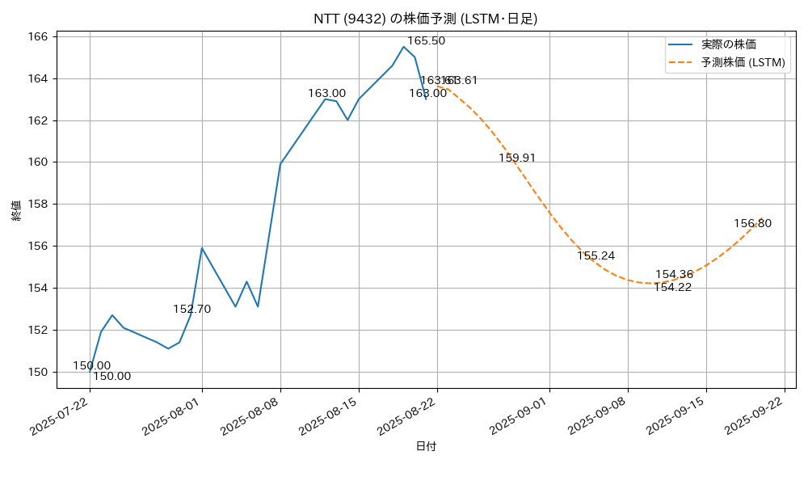

# Stock Price Information Forecasts Project

[](https://opensource.org/licenses/Apache-2.0)

## Overview

This application analyzes and visualizes stock market data.
It stores historical OHLC (Open, High, Low, Close) data and a list of stocks in a PostgreSQL database. 
To enhance data processing performance, it optionally supports CUDA acceleration. 
The development and deployment environments are containerized using Docker Compose for easy setup.

## Features

Forecasts future stock prices using historical data stored in the database, starting from a specified stock price.

## System Architecture

```
+-------------------------------+      +--------------------------+
|                               |      |                          |
|   Python Container            |----->|   PostgreSQL Container   |
|  ( python-app)                |      |      (postgres-db)       |
|                               |      |                          |
|                               |      | - stocks table           |
| - create_candlestick_chart.py |      | - stock_values table     |
|                               |      | - usdjpy_values table    |
|                               |      |                          |
+-------------------------------+      +--------------------------+
```

- **Python Container:** Executes the main application logic.
- **PostgreSQL Container:** Persists the collected data.

## Getting Started

### Prerequisites

- Git
- Docker and Docker Compose
- Historical OHLC (Open, High, Low, Close) data

### Docker Setup

You need a running Docker environment to use this project. Follow the instructions for your operating system.

-   **Windows**
    1.  Install [Windows Subsystem for Linux (WSL) 2](https://docs.microsoft.com/en-us/windows/wsl/install). This is a required backend for Docker Desktop on Windows.
    2.  Download and install [Docker Desktop for Windows](https://docs.docker.com/desktop/install/windows-install/).
    3.  During installation, ensure you select the "Use WSL 2 based engine" option.

-   **macOS**
    1.  Download and install [Docker Desktop for Mac](https://docs.docker.com/desktop/install/mac-install/).
    2.  Make sure to choose the correct version for your Mac's chip (Apple Silicon or Intel).

-   **Linux**
    1.  Follow the official instructions to install [Docker Engine for your Linux distribution](https://docs.docker.com/engine/install/#server) (e.g., Ubuntu, Debian, CentOS).
    2.  After installing Docker Engine, follow the steps to install the [Docker Compose plugin](https://docs.docker.com/compose/install/linux/) (`docker-compose-plugin`). Note: On most modern installations, `docker compose` is included with Docker Engine and this step may not be necessary.
    3.  (Optional) You can also install [Docker Desktop for Linux](https://docs.docker.com/desktop/install/linux-install/).

After installation, verify that Docker is running by opening your terminal and executing `docker --version` and `docker compose version`.

### Installation and Execution

These instructions are cross-platform and should work on Windows, macOS, and Linux, provided you have Git and Docker installed. The following commands should be run in your terminal.

-   **On Windows:** Use PowerShell or [Windows Subsystem for Linux (WSL)](https://docs.microsoft.com/en-us/windows/wsl/install).
-   **On macOS:** Use the built-in Terminal app.
-   **On Linux:** Use your preferred terminal application.

1.  **Clone the repository:**
    ```bash
    git clone https://github.com/mame-777/analyzestock.git
    cd analyzestock
    ```

2.  **Set up environment variables:**
    Create a `.env` file in the project root directory and add your PostgreSQL connection details.
    ```env
    # Example .env file
    POSTGRES_USER=user
    POSTGRES_PASSWORD=password
    POSTGRES_DB=stockdb
    POSTGRES_HOST=postgres-db
    POSTGRES_PORT=5432
    ```

3.  **Build and start the Docker containers:**
    Run the following command to build the images and start the services in the background.
    ```bash
    docker-compose up --build -d
    ```

4. **Insert historical OHLC (Open, High, Low, Close) data into the database according to the stock_values schema.**
   📥 Data Acquisition
    - Scrape the latest stock listings (Excel format) from the official JPX website.
    - Retrieve historical OHLC (Open, High, Low, Close) data via APIs or CSV sources (e.g., Yahoo Finance, JPX).
   🧹 Data Cleaning
    - Handle missing or anomalous values.
    - Standardize date and numeric formats.
    - Normalize stock codes and market classifications.
   🏗️ Database Structure
    - Store stock listings in the stock schema (e.g., code, name, market, sector, etc.).
    -  Store price history in the stock_values schema (e.g., symbol, date, open, high, low, close).

5. **Run the application:**
    Access the Python container's shell (`python-app`) to execute the script.
    ```bash
    docker exec -it python-app bash
    ```
    Then, inside the container's shell, run the main script for data collection.

    To generate candlestick charts, run:
    ```bash
    python create_candlestick_chart.py --timeframe D --start-date YYYY-MM-DD --end-date YYYY-MM-DD
    ```
    (Replace `YYYY-MM-DD` with desired dates, and `D` with `W`, `M`, or `Y` for weekly, monthly, or yearly charts.)

    To generate stock prediction charts, run:
    ```bash
    python create_stock_prediction_chart.py --stock_code <stock_code> --model_type <model_type> --time_frame <time_frame>
    ```
    - `<stock_code>`: Stock ticker code (e.g., 9432).
    - `<model_type>`: Model to use, 'lstm' or 'nn'.
    - `<time_frame>`: Time frame, 'daily' or 'weekly'.

    Example:
    ```bash
    python create_stock_prediction_chart.py --stock_code 9432 --model_type lstm --time_frame daily
    ```

### Sample Prediction Chart



5.  **Stopping the containers:**
    When you are finished, stop the services.
    ```bash
    docker-compose down
    ```
    Add the `-v` flag if you want to remove the PostgreSQL data volume as well.

## Database Schema

### `stocks` Table

Stores metadata for listed stocks retrieved from JPX.

| Column Name              | Type                     | Description                              |
| ------------------------ | ------------------------ | ---------------------------------------- |
| `record_date` (PK)       | `VARCHAR(8)`             | Data reference date (e.g., `20231229`)   |
| `code` (PK)              | `VARCHAR(10)`            | Stock ticker code                        |
| `stock_name`             | `VARCHAR(255)`           | Stock name                               |
| `market_product_segment` | `VARCHAR(50)`            | Market/Product segment (e.g., Prime)     |
| `sector_code_1`          | `VARCHAR(10)`            | 33-sector code                           |
| `sector_name_1`          | `VARCHAR(50)`            | 33-sector classification name            |
| `sector_code_2`          | `VARCHAR(10)`            | 17-sector code                           |
| `sector_name_2`          | `VARCHAR(50)`            | 17-sector classification name            |
| `scale_code`             | `VARCHAR(10)`            | Size code                                |
| `scale_name`             | `VARCHAR(50)`            | Size classification name                 |
| `updated_by`             | `VARCHAR(255)`           | Program name that executed the update    |
| `updated_at`             | `TIMESTAMP WITH TIME ZONE` | Timestamp of the record update           |

### `stock_values` Table

Stores daily stock price data retrieved.

| Column Name      | Type                     | Description                      |
| ---------------- | ------------------------ | -------------------------------- |
| `record_date` (PK) | `DATE`                   | Date of the stock price data     |
| `code` (PK)      | `VARCHAR(10)`            | Stock ticker code                |
| `open`           | `NUMERIC`                | Opening price                    |
| `high`           | `NUMERIC`                | Highest price                    |
| `low`            | `NUMERIC`                | Lowest price                     |
| `close`          | `NUMERIC`                | Closing price                    |
| `volume`         | `BIGINT`                 | Trading volume                   |
| `dividends`      | `NUMERIC`                | Dividends                        |
| `stock_splits`   | `NUMERIC`                | Stock splits                     |
| `updated_by`     | `VARCHAR(255)`           | Program name that did the update |
| `updated_at`     | `TIMESTAMP WITH TIME ZONE` | Timestamp of the record update   |

### `usdjpy_values` Table

Stores daily USD/JPY exchange rate data.

| Column Name      | Type                     | Description                      |
| ---------------- | ------------------------ | -------------------------------- |
| `record_date` (PK) | `DATE`                   | Date of the exchange rate data   |
| `open`           | `NUMERIC`                | Opening price                    |
| `high`           | `NUMERIC`                | Highest price                    |
| `low`            | `NUMERIC`                | Lowest price                     |
| `close`          | `NUMERIC`                | Closing price                    |
| `updated_by`     | `VARCHAR(255)`           | Program name that did the update |
| `updated_at`     | `TIMESTAMP WITH TIME ZONE` | Timestamp of the record update   |

## File Structure

```
.
├── .env                       # Docker environment variables
├── .gitignore                 # Git ignore settings
├── create_stock_prediction_chart.py # Stock prediction chart generation script
├── database_schema.sql        # PostgreSQL database schema
├── docker-compose.yml         # Docker Compose configuration
├── dockerfile                 # Dockerfile for Python application
├── README.md                  # Project README file
└── requirements.txt           # Python dependencies
```

## License

This project is licensed under the Apache License, Version 2.0. See the [LICENSE](LICENSE) file for details.

## Third-Party Licenses

This project utilizes the following third-party libraries, each under their respective licenses:

*   **Apache License 2.0:**
    *   `selenium`
    *   `requests`
*   **BSD 3-Clause License (or similar BSD-style):**
    *   `pandas`
    *   `xlrd`
    *   `matplotlib`
    *   `python-dotenv`
    *   `scikit-learn`
    *   `torch` (PyTorch)
    *   `torchvision`
    *   `torchaudio`
*   **MIT License:**
    *   `beautifulsoup4`
    *   `openpyxl`
    *   `SQLAlchemy`
    *   `plotly`
*   **GNU Lesser General Public License (LGPL) v3 or later:**
    *   `psycopg2-binary`
*   **Python License / Zero Clause BSD License (for examples):**
    *   `argparse`
